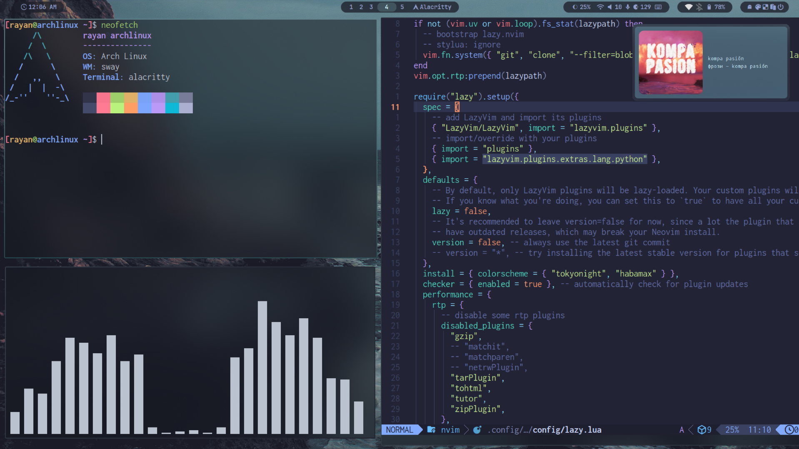

<h1 align="center">My Linux Setup DWM</h1>

This is where i keep all my dotfiles for the programs i use.

Feel free to copy any of the dotfiles or scripts you find here, as much of it is just copied from others' dotfiles. Please do not try to copy my entire setup, as it is very disorganized and specific to my needs. Instead, try copying bits and pieces as you put together your own dotfiles unique to you.
